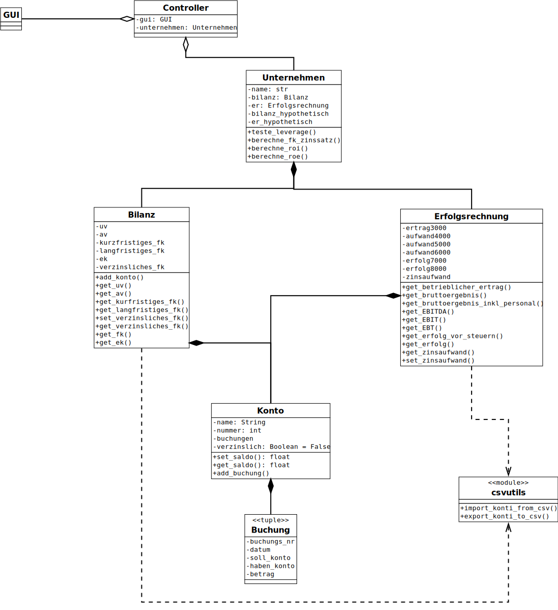

# Klassen als Mittel zur Flexibilisierung

Die objektorientierte Programmierung ermöglicht es, Klassen unterschiedlich zu
implementieren. Es muss nur sichergestellt werden, dass die deklarierten
Schnittstellen eingehalten werden.

Ausgehend vom Rechner zur Kontrolle des Leverage Effekts wie er im
untenstehenden Klassendiagramm dargestellt wird, spielt es keine Rolle, wie in
der Klasse Bilanz die einzelnen Konti abgespeichert werden. Entscheidend ist
lediglich, dass der Klasse Unternehmen die erforderlichen Informationen in der
angegebenen Form zur Verfügung gestellt werden können.

